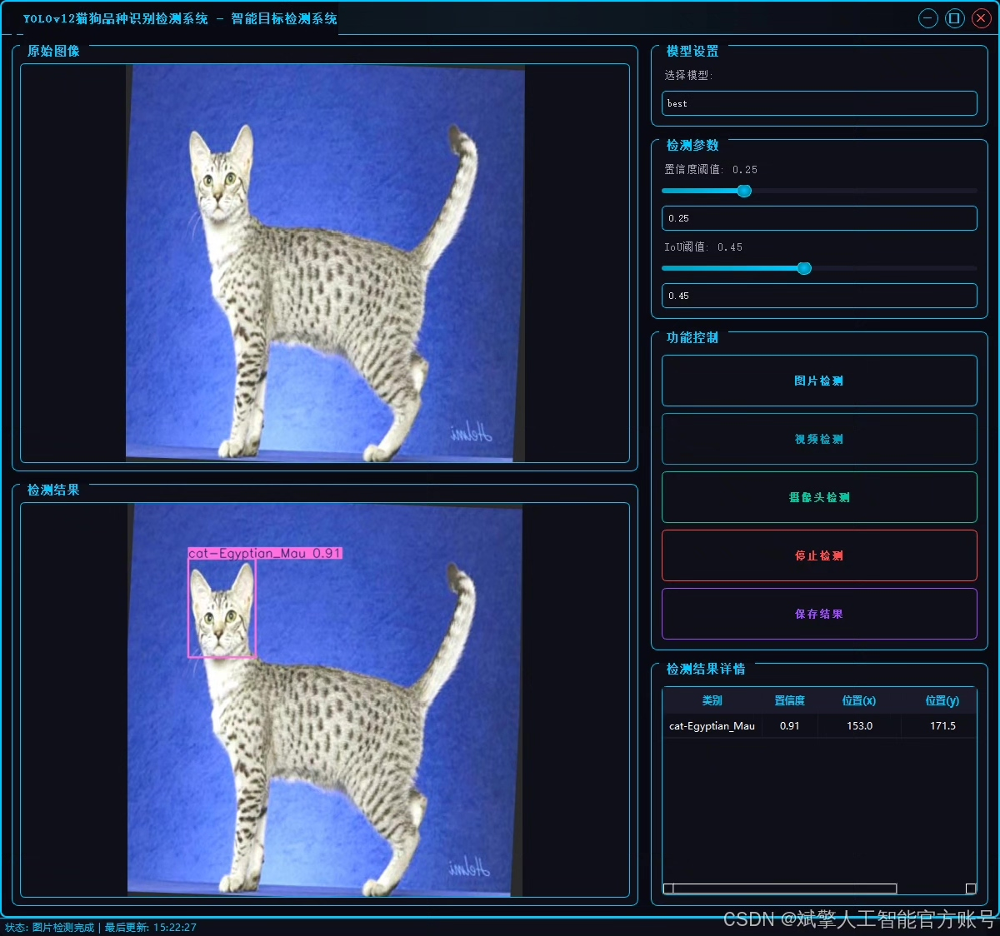
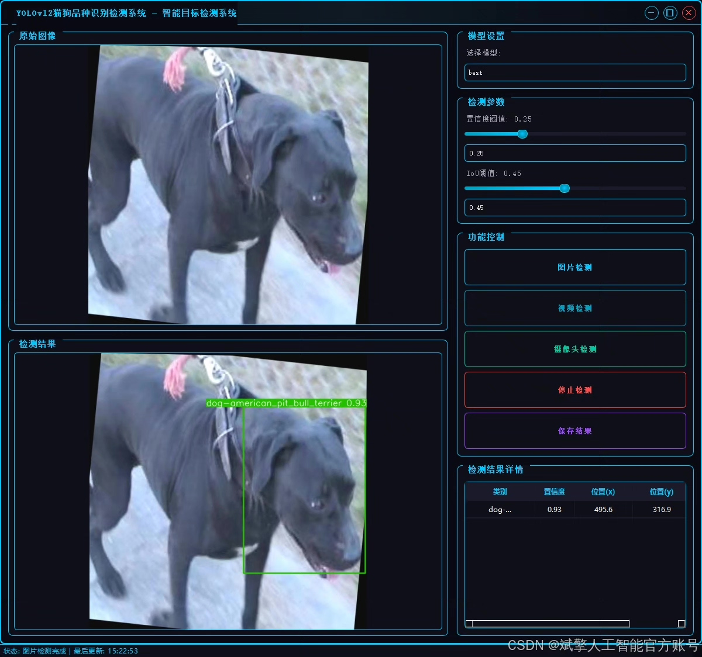
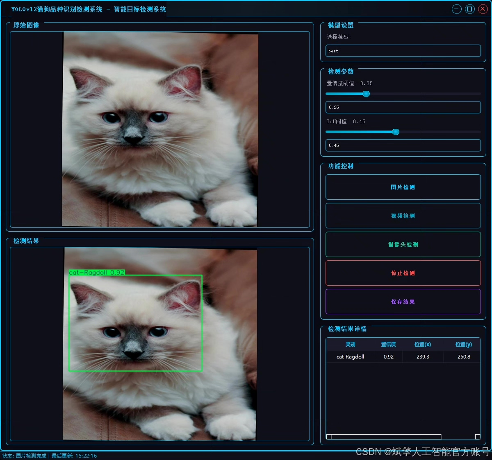
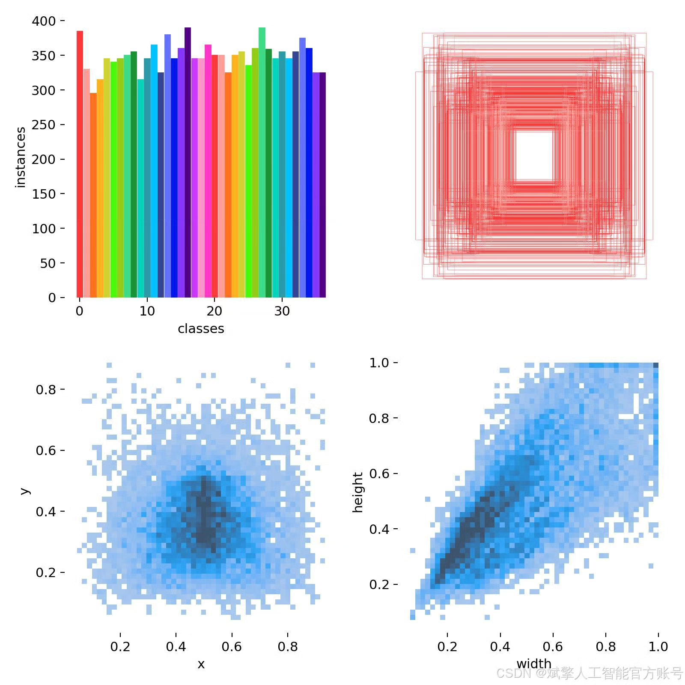
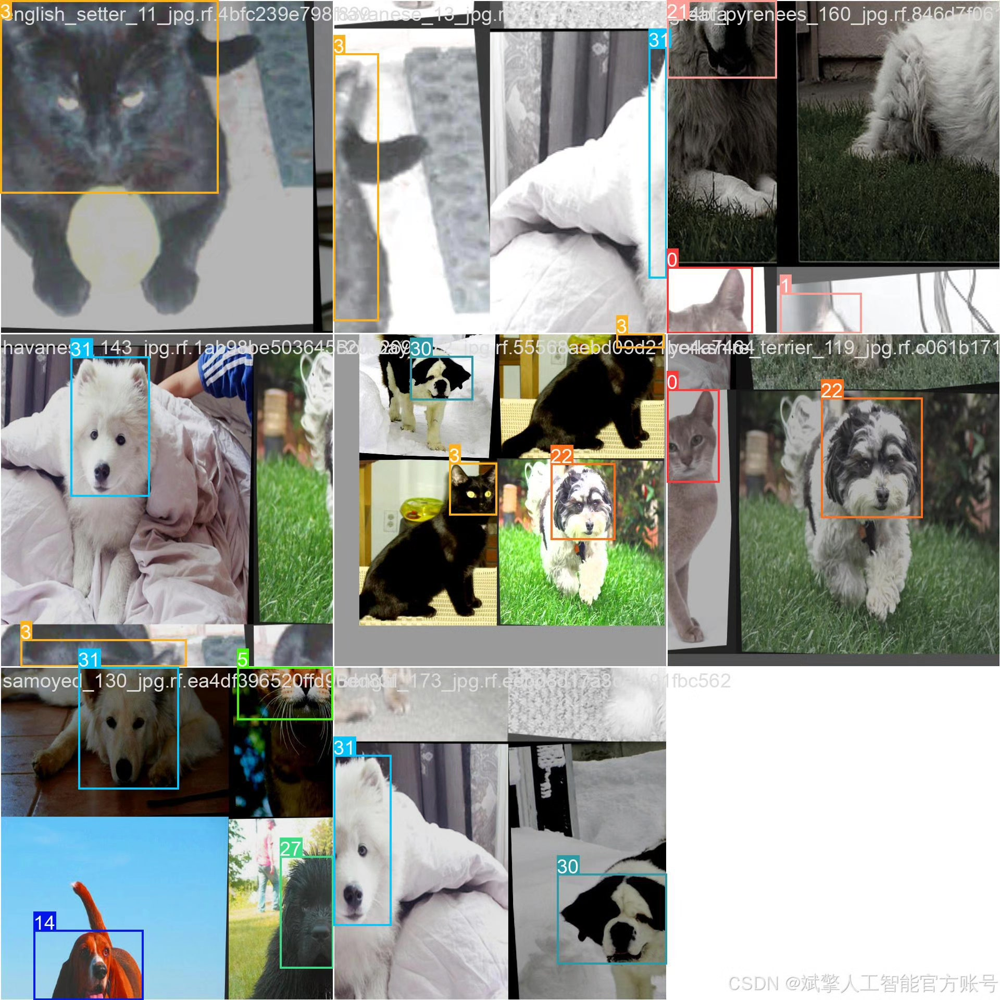
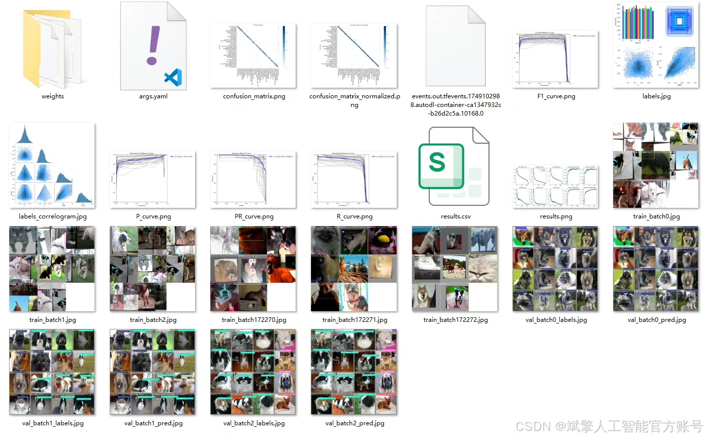
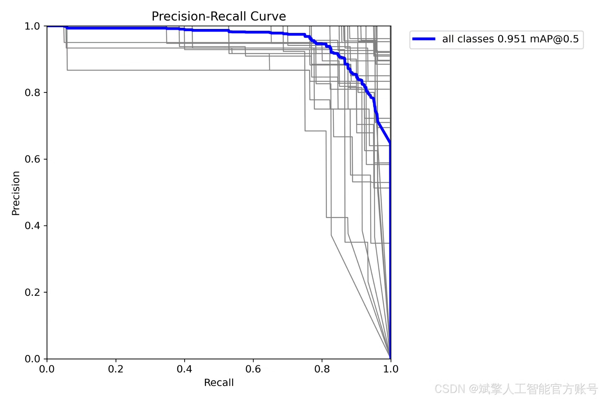
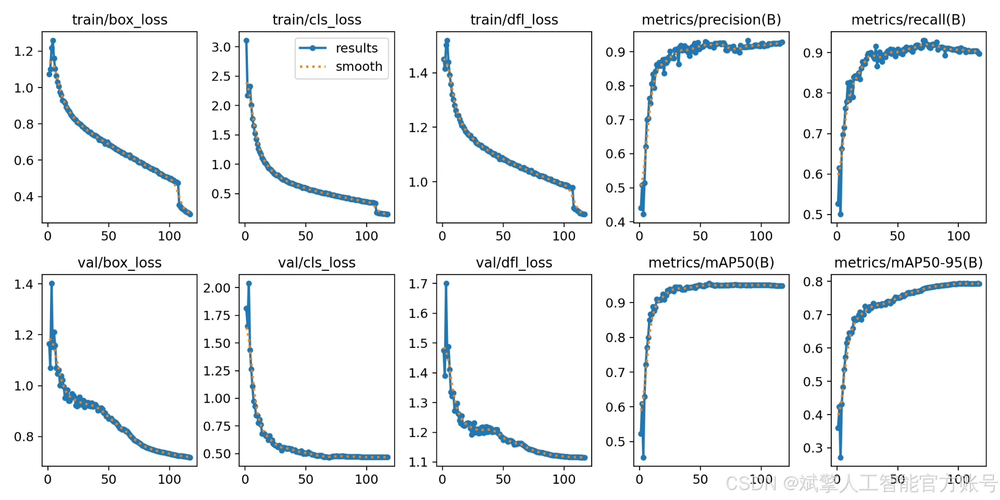
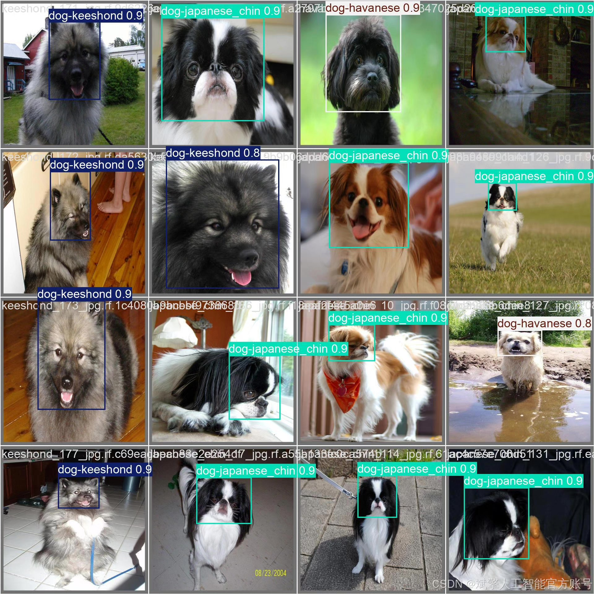

# YOLOv12 Cat Dog Breed Identification System

## Body

YOLOv12 Cat and Dog Breed Identification System Based on Deep Learning YOLOv12: A Cat and Dog Breed Identification and Detection System (YOLOv12+YOLO dataset + UI interface + login registration interface + Python project source code + model)

With the rapid development of artificial intelligence and computer vision technology, deep learning-based target detection technology has shown great potential in the field of image recognition. The purpose of this project is to develop a high-precision, high-efficiency cat and dog breed identification and detection system. The system adopts the cutting-edge YOLOv12 object detection algorithm as its core architecture, which significantly improves speed and accuracy compared to previous versions, capable of quickly and accurately localizing and classifying cat and dog targets in images or real-time video streams.

The project constructs a large-scale custom dataset with 37 cat and dog breeds (nc=37), totaling 13,983 labeled images. The system's back end is based on the PyTorch deep learning framework for model training and optimization, while the front end develops a user-friendly graphical interface (UI), integrating login registration, image upload, real-time detection, and result visualization. Experimental results show that the final trained model achieves an excellent average precision (mAP) of 95.1% on the independent test set, verifying the effectiveness and reliability of the system in practical applications. This project provides a comprehensive technical solution and engineering practice reference for fields such as pet recognition, intelligent security, and animal studies.

✅ User Login Registration: Supports password verification and security validation.
✅ Three detection modes: Based on the YOLOv12 model, supports image, video, and real-time camera detection, accurately identifying targets.
✅ Dual-screen comparison: Displays the original scene and detection results simultaneously on the screen.
✅ Data visualization: Real-time table displaying the category, confidence, and coordinates of detected targets.
✅ Intelligent parameter adjustment: Offers a confidence slide bar, dynamically optimizing detection accuracy to meet different scene needs.
✅ Sci-fi style interactive interface: Dark theme paired with dynamic light effects, reducing visual fatigue and enhancing operational experience.

## Images

## Payment

Here is a pay link on Stripe ( https://buy.stripe.com/3cs8yP7sY87d0vu9AB ). Please contact me lonlonago@foxmail.com after funding $89, and I will send you a complete data files , thank you!

